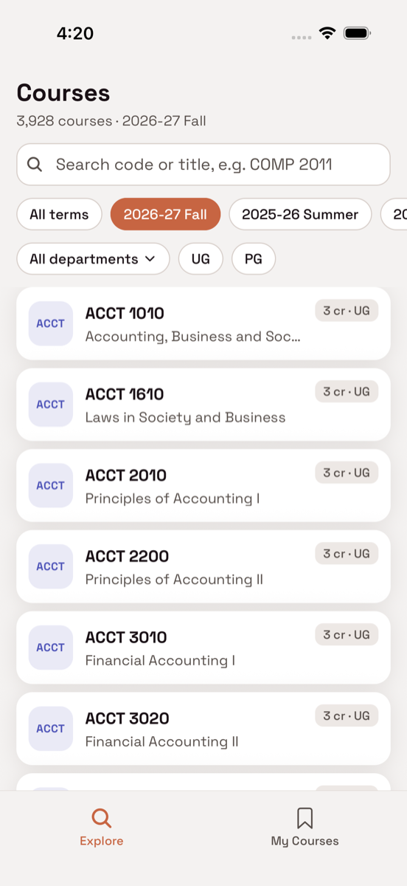
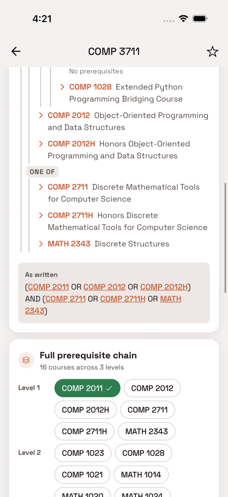
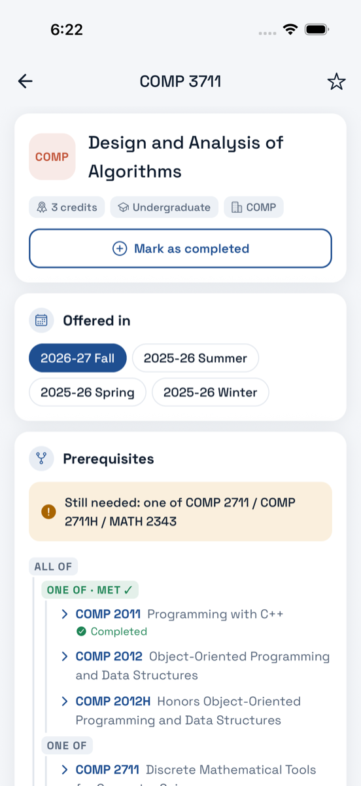
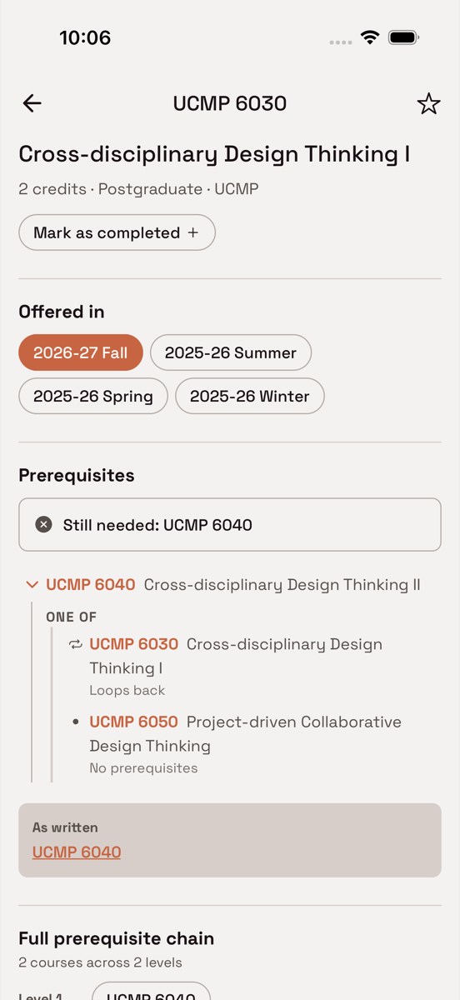
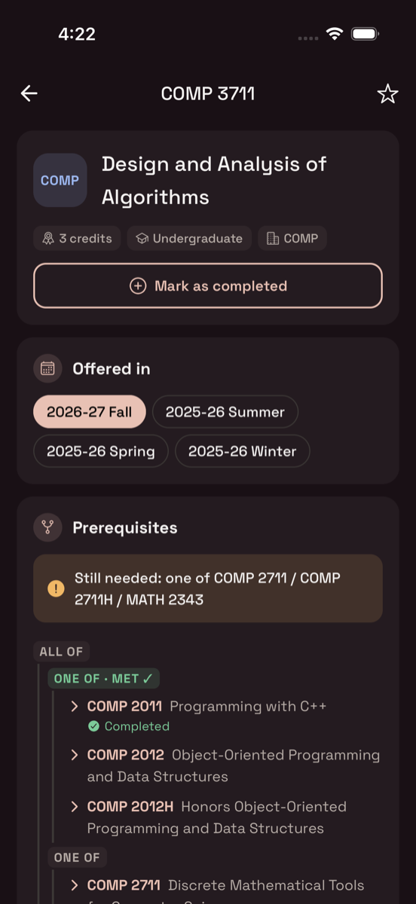

# HKUST Course Explorer

A React Native + Expo app for browsing HKUST courses and understanding their prerequisites. Built for the USThing App Team 2026-27 Fall technical test on the provided Ignite template, using the supplied local `courses.json`. There's no backend and no network.

<p align="center">
  
  
  
  
  
</p>

**What it does**

- **Browse & search** 4,030 courses across 4 terms and 129 departments. Search by code (`comp3711`, `COMP 3711`) or title (`operating systems`, even `systems operating`). Filter by semester, department and UG/PG.
- **Course details**, per term (descriptions and prerequisites change between terms): credits, description, prerequisites, co-requisites, exclusions, attributes, learning outcomes. Course codes in free text are tappable links.
- **Prerequisite explorer** *(required challenge)*:
  - An expandable AND/OR tree: expand any prerequisite to reveal its own, as deep as the chain goes.
  - Tap any course to open it.
  - Cycles are marked "↻ Loops back" instead of recursing (the data has a real one, `UCMP 6030 ↔ UCMP 6040`).
  - Courses missing from the catalogue and non-course requirements (HKDSE, IELTS…) are shown as such.
  - Also: a **full-chain** summary by level, and **"Leads to"**, the courses that list this one as a prerequisite.
- **My courses** *(optional features)*:
  - Star courses.
  - Mark courses as **completed** to see whether you meet a course's prerequisites ("Still needed: one of COMP 2711 / MATH 2343").
  - Filter Explore to **"Unlocked for me"**: everything you can take next.
- Light/dark mode, VoiceOver labels on interactive elements, and state that persists across launches.

---

## Setup and running

**Requirements:** Node ≥ 20, Yarn 1 (pinned via `packageManager`; `corepack enable` picks it up), Xcode with an iOS simulator (or Android Studio with an emulator).

```bash
git clone https://github.com/BhanuRana/usthing-app-test-2026.git
cd usthing-app-test-2026
yarn install
yarn ios          # builds the dev client and opens it in the iOS simulator (first build takes ~10 min)
                  # or: yarn android
yarn start        # afterwards, start Metro on its own when the app is already installed
```

The template uses `expo-dev-client` (for MMKV), so it runs as a development build, not in Expo Go.

**Dataset.** The supplied `courses.json` is included at the repo root. The app doesn't read it directly. It reads the preprocessed files in `app/data/generated/`, which are committed, so nothing extra is needed to run. To regenerate them after changing the dataset:

```bash
yarn data         # courses.json -> app/data/generated/ (~2 s)
```

**Checks**

```bash
yarn test         # 43 Jest tests: parser, traversal, eligibility, search on the real data
yarn compile      # TypeScript
yarn lint:check
yarn bench        # data-layer micro-benchmarks
maestro test -e MAESTRO_APP_ID=com.usthing.apptechtest27 .maestro/flows   # 4 end-to-end flows (needs Maestro + a running app)
```

## Platforms tested

| Platform | Build | Result |
|---|---|---|
| iOS 26.5 simulator, iPhone 17 Pro | Debug (dev client) and Release, including a Release build from a fresh `git clone` | All features, light and dark mode; 4/4 Maestro E2E flows pass |
| Android | Not tested | Nothing in the code is iOS-specific (template components, React Navigation, MMKV), but I haven't run it on Android |

---

## Architecture

```
scripts/build-data.ts        courses.json -> app/data/generated/   (build time, Node)
app/data/
  types.ts                   shapes of the generated data
  catalog.ts                 loading, lookup, search/filter, "unlocked" query
  prereq/parse.ts            prerequisite text -> AND/OR tree
  prereq/traverse.ts         per-term lookup, cycle checks, full chain (BFS)
  prereq/evaluate.ts         tree vs. completed courses -> met / unmet / unknown
  generated/                 index.json, prereqs.json, details/<DEPT>.json (committed)
app/screens/                 ExploreScreen, CourseDetailScreen, MyCoursesScreen
app/components/course/       CourseRow, Chip, DepartmentPicker, PrereqTree, LinkedCodesText
app/utils/usePreferences.ts  starred / completed / selected term (MMKV)
app/navigators/              stack (Tabs → CourseDetail) + bottom tabs (Explore, My Courses)
```

- **The data layer is plain TypeScript with no React.** The build script, the app, the Jest tests and the benchmark all use the same `app/data` code. The screens only call its functions.
- **Navigation:** a native stack on top of two tabs. Course pages are *pushed*, so following a prerequisite chain builds a back stack you can retrace.
- **State management:**
  - The catalogue is static and synchronous, so there's no server state to manage. It lives in module-level caches in `catalog.ts`.
  - UI state (search text, department/career filters) is local component state.
  - The three persisted preferences (starred, completed, selected term) use `react-native-mmkv` hooks, the same mechanism the template uses for its theme. They subscribe to their key, so every screen stays in sync without a context provider or a state library.
  - The rationale is in [D7](docs/DECISIONS.md#d7--state-component-state--mmkv-hooks-no-state-library-2026-09-24).
- **Built on the template:** its `Screen`, `Text`, `TextField`, `Header`, `EmptyState`, themes and typed i18n (`tx` keys, English only). The Ignite demo screens, auth flow and API client were removed.

## How the dataset is processed, searched and filtered

`courses.json` is 28 MB: **15,178 rows = 4 terms × ~3,800 courses**, but only **4,030 unique course codes**. Learning outcomes and descriptions are about half the bytes. Parsing the raw file takes ~100 ms on a laptop (more on a phone), and every launch would pay that. So it's preprocessed once at build time:

| Output | Contents | Size | Loaded |
|---|---|---|---|
| `index.json` | one row per code: code, title, credits, UG/PG, terms offered | 574 KB | first screen |
| `prereqs.json` | 787 distinct prerequisite strings parsed once into trees, plus a reverse index | 176 KB | first course view |
| `details/<DEPT>.json` × 129 | full per-term content | 5.3 MB total, ≤ 457 KB each | when you open a course in that department |

- **Per-term versions.** The same code's content changes between terms: the prerequisites of 117 codes, the descriptions of 107, and the titles of 58. Each course stores a list of *versions*, and terms with identical content collapse into one version. The detail screen shows the version for the semester you're browsing, and falls back to the newest one if the course isn't offered then.
- **Lazy details.** Metro can't `require()` a computed path, so the build script also generates `details/index.ts`, a static map of `DEPT: () => require("./DEPT.json")`. With `inlineRequires` and Hermes bytecode, a department's module runs only the first time it's opened.
- **Search** is a linear scan over lower-cased keys computed once, ranked as: exact code › code prefix › title prefix › title word › title substring › all query words in any order. Codes match regardless of case and spacing. The search input updates immediately, and the list filters on a `useDeferredValue` copy so typing never blocks.
- **Filters** (term, department, UG/PG, "Unlocked for me") are applied in the same pass. The department picker shows live counts under the other active filters, so you can see a dead end before picking it.
- **Lists** are `FlatList`s with fixed-height, memoised rows and `getItemLayout`, so ~4,000 rows are never measured. Titles are one line and font scaling is capped so rows always fit.

## How prerequisite traversal works

**1. Parsing** (`prereq/parse.ts`, build time). A small tokenizer produces course codes, `AND`/`OR`, brackets, separators and words. A recursive-descent parser then builds a tree of `course | all | any | text` nodes. The rules come from the data (all 787 strings were profiled):

- `()` and `[]` group, and a spaced ` / ` means OR.
- **OR binds tighter than AND.** Of 175 strings that mix both, only 3 aren't fully bracketed, and the one real case (`ECON 2103, ECON 2113 OR ECON 3113, AND ECON 2123 OR ECON 3123`) only reads correctly this way.
- `,` and `;` take the operator used in their segment (`A, B OR C` → any; `A, B, and C` → all).
- `or above` and `or equivalent` are prose, not operators.
- Text next to a course becomes that course's **note** (`Grade A- or above in` MATH 1014, MATH 1012 `(prior to 2025-26)`). Other text stays a **text** node. Nothing is dropped, and the original string is always shown under the tree ("As written").

**2. The tree view** (`PrereqTree.tsx` + `prereq/traverse.ts`). It shows the course's direct prerequisites, and each course node expands **one level at a time**. So what gets rendered depends only on what you open, not on the size of the graph (the deepest chain, DSAA 3072, is 9 levels). Each node carries its **ancestor path**:
- If a course is already on its own path, it's a **cycle**: it's shown as "↻ Loops back" and can't be expanded.
- The same course on *different* branches is legitimate, and stays expandable.

**3. The full chain** is a breadth-first search with a visited set. It lists every transitive prerequisite once, at its shallowest level, and terminates on cycles and shared subtrees.

**4. "Leads to"** comes from a reverse index built at preprocessing time: an O(1) lookup instead of scanning every course.

**5. Eligibility** (`prereq/evaluate.ts`) evaluates a tree against your completed courses with three-valued logic:
- a course is *met* or *unmet*; free text is *unknown* (the app can't check your HKDSE results);
- AND is unmet if any child is unmet, and OR is met if any child is met;
- unknowns propagate otherwise.

It only evaluates a course's *direct* prerequisites (having completed a course is a fact), so it doesn't recurse across courses and can't loop. "Unlocked for me" runs it for all 4,030 courses in under a millisecond.

## Performance

`yarn bench` on an M1 Pro (Node). Hermes on a phone is slower, but even 10× these numbers stays well under a 16 ms frame.

| Operation | Median |
|---|---|
| Parse the raw `courses.json` (what we avoid at startup) | 99 ms |
| Parse `index.json` (what we do at startup) | 1.7 ms |
| Search "comp" / "operating systems" over all courses | 0.4 / 0.5 ms |
| Full prerequisite chain of DSAA 3072 (9 levels) | 0.02 ms |
| Evaluate all 4,030 courses for "Unlocked for me" | 0.4 ms |

The production iOS bundle is 9.5 MB of Hermes bytecode, mostly the lazily loaded detail chunks ([D9](docs/DECISIONS.md#d9--bundle-size-vs-startup-2026-09-24)).

## Testing

- **Jest (43 tests):**
  - the parser on real-world strings (brackets, precedence, notes, `or above`, enumerators, unbalanced parentheses);
  - traversal (per-term lookup, cycles, self-reference, shared subtrees);
  - eligibility (three-valued logic, "still needed");
  - search/filter/unlocked on the **real generated data**;
  - plus the template's i18n key check.
- **Maestro (4 flows in `.maestro/flows`):** search → open → follow a prerequisite → back; the UCMP cycle; department + career filter → star → My Courses; complete two courses → eligibility changes → "Unlocked for me".

## Assumptions and limitations

- **Prerequisite parsing is best-effort**, as the brief allows. The rules cover the observed grammar, and anything unusual degrades to readable text rather than being dropped. The raw string is always shown next to the tree.
- **Deeper tree levels use each course's newest version.** Only the course you're viewing follows the selected term, because "the prerequisites of a prerequisite in a given term" isn't well defined.
- **"Leads to" spans all terms.** A course that listed this one as a prerequisite in any term is included.
- **Eligibility only checks course prerequisites.** Co-requisites, exclusions, grade conditions ("Grade A- or above") and non-course requirements aren't enforced. Grade notes are shown, and text requirements make the result "can't verify" rather than a guess.
- **Section data (quota, enrolment, waitlist) isn't shown**, per the 2026-09-24 brief update. The dataset doesn't include it.
- **Not tested on Android** (see above).

## Documentation

- [docs/DECISIONS.md](docs/DECISIONS.md): every significant decision, with the alternatives considered and why.
- [docs/BUILD-LOG.md](docs/BUILD-LOG.md): how the app was built, step by step, including what the QA pass found.

AI assistance (Claude Code) was used during development, as the brief permits.
