# HKUST Course Explorer

A React Native + Expo app for browsing HKUST courses, understanding their prerequisites, and planning how to get to the course you want. Built for the USThing App Team 2026-27 Fall technical test on the provided Ignite template, using the supplied local `courses.json`. There's no backend and no network.

<table>
  <tr>
    <td align="center">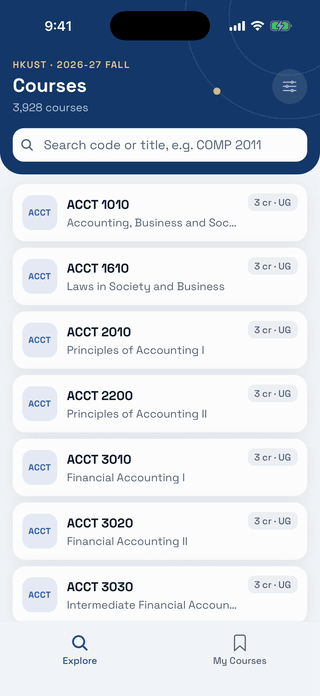</td>
    <td align="center">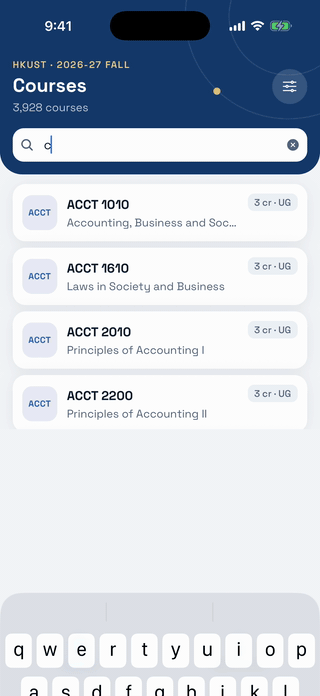</td>
    <td align="center">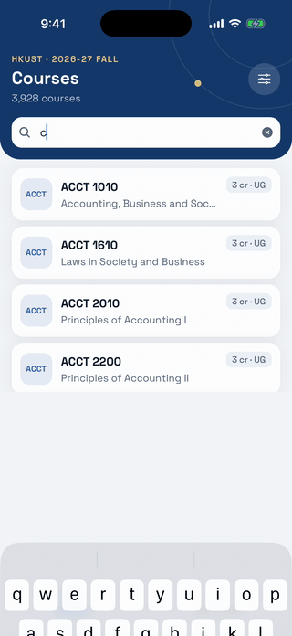</td>
  </tr>
  <tr>
    <td align="center"><b>Find a course</b><br/>Filter, search by title, follow the prerequisite tree</td>
    <td align="center"><b>See the whole chain</b><br/>A zoomable map: light up a lineage, explore where courses lead</td>
    <td align="center"><b>Plan the route</b><br/>Star with prerequisites, then watch "Your path" shrink</td>
  </tr>
</table>

**Contents:** [At a glance](#at-a-glance) · [What it does](#what-it-does) · [Setup](#setup-and-running) · [Architecture](#architecture) · [Dataset](#how-the-dataset-is-processed-searched-and-filtered) · [Prerequisite traversal](#how-prerequisite-traversal-works) · [Performance](#performance) · [Testing](#testing) · [Limitations](#assumptions-and-limitations) · [Next](#what-id-do-next)

## At a glance

| Area | Delivered | Where |
|---|---|---|
| Local dataset, Ignite template | `courses.json` preprocessed at build time; the template's components, theme and i18n kept | [`scripts/build-data.ts`](scripts/build-data.ts), [dataset](#how-the-dataset-is-processed-searched-and-filtered) |
| Browse and search | 4,030 courses; code and title search, ranked, with highlighted matches | [`catalog.ts`](app/data/catalog.ts) · Explore · `SearchAndOpenCourse` flow |
| Filters | Term, level, department, "Unlocked for me", with a live result count | [`FilterSheet.tsx`](app/components/course/FilterSheet.tsx) · `FilterAndStar` flow |
| Course details | Per-term content: credits, description, prerequisites, co-requisites, exclusions, attributes, outcomes | Course page |
| **Prerequisite explorer** (required challenge) | Expandable AND/OR tree, tap to open any course, full chain, "Leads to", and a zoomable map of the whole chain | [`parse.ts`](app/data/prereq/parse.ts), [`traverse.ts`](app/data/prereq/traverse.ts), [`map.ts`](app/data/prereq/map.ts) · [how it works](#how-prerequisite-traversal-works) |
| Cycles and missing courses | Real cycle (UCMP 6030 ↔ 6040) marked, not followed, in the tree and on the map; missing courses and free text shown as such | `PrerequisiteCycle`, `CourseMap` flows · traversal and map tests |
| Optional features | Starring, completed courses and eligibility, "Unlocked for me", My Courses stats | [`evaluate.ts`](app/data/prereq/evaluate.ts) · `CompletionUnlocks` flow |
| Beyond the brief | Star with prerequisites; "Your path", a planned route to any course | [`plan.ts`](app/data/prereq/plan.ts) · `StarPrerequisites`, `CoursePath` flows |
| Documentation | Setup, architecture, data processing, traversal, assumptions; every decision and the build log | This README · [DECISIONS](docs/DECISIONS.md) · [BUILD-LOG](docs/BUILD-LOG.md) |
| Quality | 81 Jest tests, 7 Maestro flows, data sweeps over every course and term, benchmarks | [Testing](#testing) · [Performance](#performance) |

## What it does

**Browse and search** 4,030 courses across 4 terms and 129 departments.
- Search by code (`comp3711`, `COMP 3711`) or title (`operating systems`, even `systems operating`). The matched part of each result is highlighted.
- Filter by term, level (UG/PG), department and "Unlocked for me" in a sheet that shows how many courses you'll get before you apply ([D16](docs/DECISIONS.md#d16--filters-in-a-sheet-2026-09-26)). Active filters stay visible as removable pills.

**Course details**, per term (descriptions and prerequisites change between terms): credits, description, prerequisites, co-requisites, exclusions, attributes, learning outcomes. Course codes in free text are tappable links.

**Prerequisite explorer** *(the required challenge)*:
- An expandable AND/OR tree: expand any prerequisite to reveal its own, as deep as the chain goes. Tap any course to open it.
- Cycles are marked "↻ Loops back" instead of recursing (the data has a real one, `UCMP 6030 ↔ UCMP 6040`).
- Courses missing from the catalogue and non-course requirements (HKDSE, IELTS…) are shown as such, and the original text is always shown under the tree.
- Also: the **full chain** by level, and **"Leads to"**, the courses that list this one as a prerequisite.
- **Course map** ([D20](docs/DECISIONS.md#d20--prerequisite-map-2026-09-27)): the whole chain and what the course leads to as a graph you can pan and pinch-zoom, with arrows showing what feeds what. "One of" groups meet at junctions ("ONE OF 3"), loops are dashed, completed and starred courses stand out, and your path is drawn through it. Once you've marked courses completed, every course says whether you can take it (**CAN TAKE**, **NEEDS 2**, or **?** when it can't be checked) and met requirements turn green, so a chain shows at a glance how far along you are ([D23](docs/DECISIONS.md#d23--what-you-can-take-on-the-map-and-completing-with-prerequisites-2026-09-28)). Tap a course to light up everything it needs and everything it feeds, with a card that says where it sits ("Direct prerequisite of COMP 3711"), whether you can take it, and a line of its description. Tap a course on the "leads to" side and it opens a new column with what *it* leads to, one branch at a time, with a breadcrumb back ([D22](docs/DECISIONS.md#d22--exploring-forward-on-the-map-2026-09-27)); or re-centre the map on any course.

**Planning** *(beyond the brief)*:
- **Completed courses** drive an eligibility check on every course page ("Still needed: one of COMP 2711 / COMP 2711H / MATH 2343"), the statuses on the map and the "Unlocked for me" filter: everything you can take next. Marking a course completed whose prerequisites aren't marked asks whether you did those too, so entering your history takes a few taps, not dozens.
- **Starring a course you can't take yet** offers to star its missing prerequisites too, letting you pick within each "one of" group ([D18](docs/DECISIONS.md#d18--starring-a-course-you-cant-take-yet-2026-09-27)).
- **Your path**: the courses still to take, in order, as a timeline ending at the course. It builds on what you've completed, follows the options you've starred, marks what you can take now, and stars the whole route in one tap ([D19](docs/DECISIONS.md#d19--your-path-2026-09-27)).
- **My Courses**: starred and completed courses, with counts of each and credits earned.

**Polish:** a navy and gold identity after HKUST's colours ([D15](docs/DECISIONS.md#d15--navy-and-gold-theme-2026-09-25), [D17](docs/DECISIONS.md#d17--navy-header-band-2026-09-26)); colour that carries meaning (navy = tappable, gold = starred, green = met, amber = still needed); a light theme whatever the phone is set to ([D21](docs/DECISIONS.md#d21--light-theme-only-2026-09-27)); VoiceOver labels on interactive elements; state that persists across launches.

### Screens

<table>
  <tr>
    <td>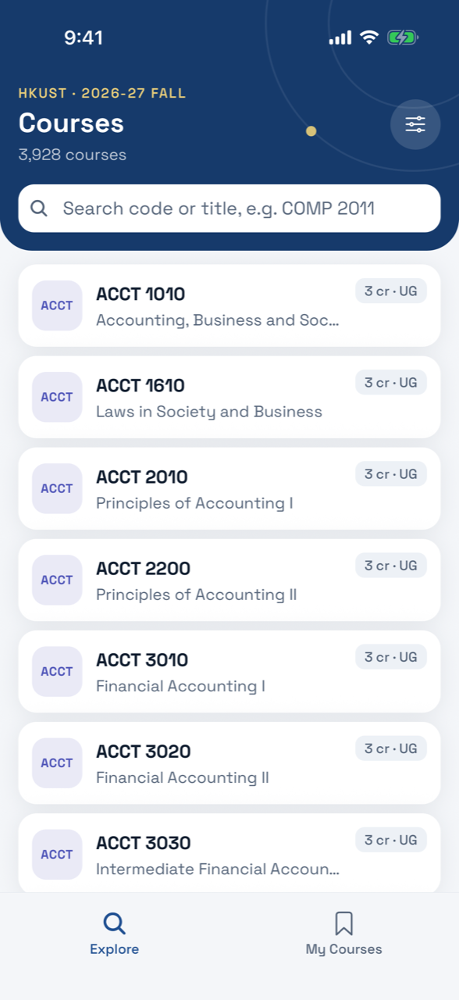</td>
    <td>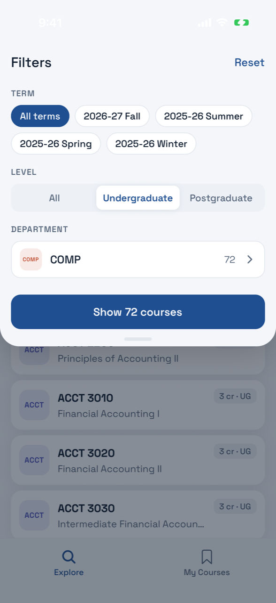</td>
    <td></td>
    <td>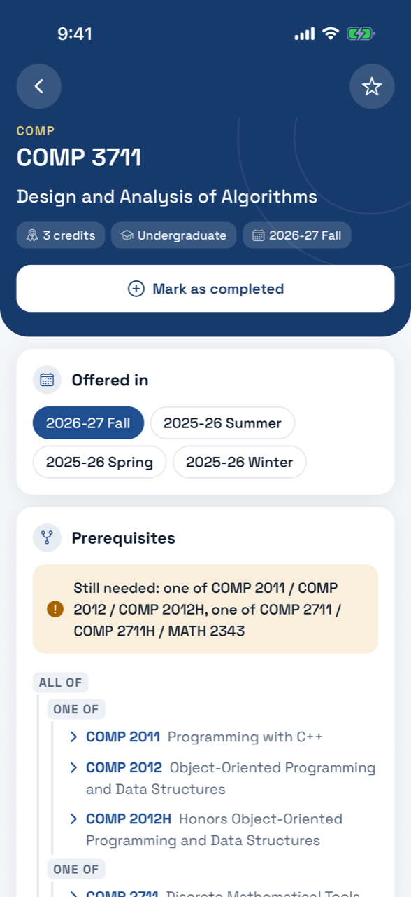</td>
    <td>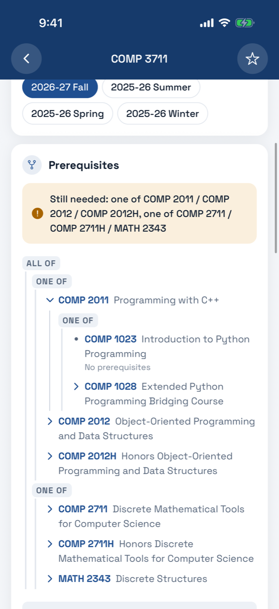</td>
  </tr>
  <tr>
    <td align="center"><sub>Explore</sub></td>
    <td align="center"><sub>Filters, with a live count</sub></td>
    <td align="center"><sub>Search highlighting</sub></td>
    <td align="center"><sub>Course page and eligibility</sub></td>
    <td align="center"><sub>Prerequisite tree</sub></td>
  </tr>
  <tr>
    <td>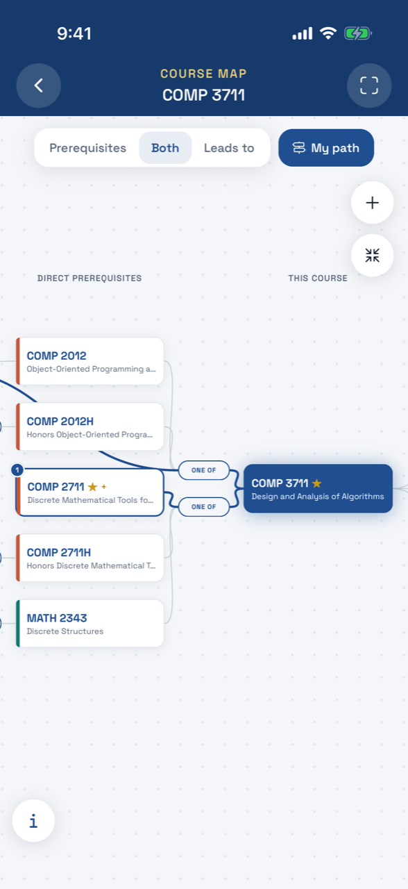</td>
    <td>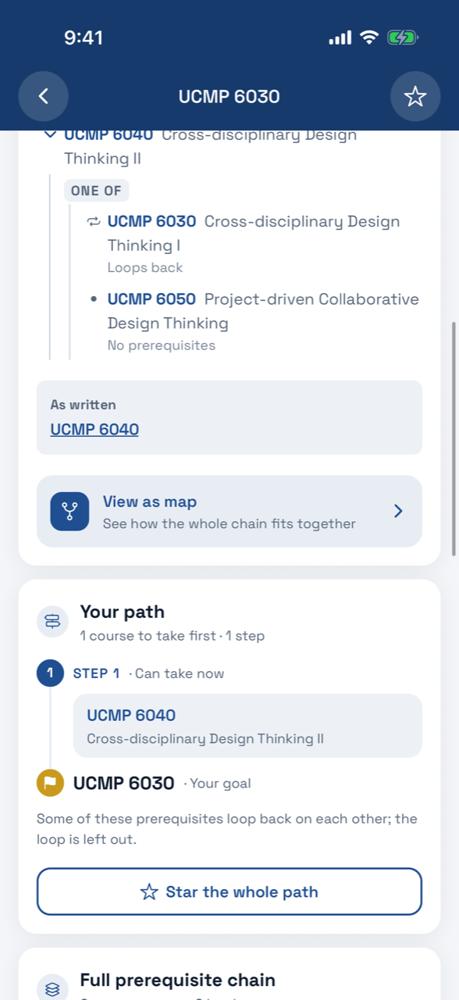</td>
    <td></td>
    <td>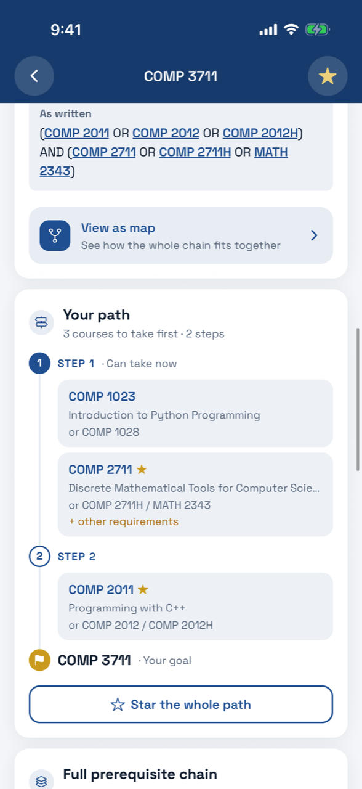</td>
    <td></td>
  </tr>
  <tr>
    <td align="center"><sub>Course map</sub></td>
    <td align="center"><sub>A real cycle, handled</sub></td>
    <td align="center"><sub>Star with prerequisites</sub></td>
    <td align="center"><sub>Your path</sub></td>
    <td align="center"><sub>My Courses</sub></td>
  </tr>
</table>

---

## Setup and running

**Requirements:** Node ≥ 20, Yarn 1 (pinned via `packageManager`; `corepack enable` picks it up), Xcode with an iOS simulator, or, for Android, the Android SDK with an emulator and **JDK 17** (the JDK React Native's Android build targets; point `JAVA_HOME` at it).

```bash
git clone https://github.com/BhanuRana/usthing-app-test-2026.git
cd usthing-app-test-2026
yarn install
yarn ios          # builds the dev client and opens it in the iOS simulator (first build takes ~10 min)
                  # or: yarn android
yarn start        # afterwards, start Metro on its own when the app is already installed
```

The template uses `expo-dev-client` (for MMKV), so it runs as a development build, not in Expo Go.

**Dataset.** The supplied `courses.json` is included at the repo root. The app doesn't read it directly. It reads the preprocessed files in `app/data/generated/`, which are committed, so nothing extra is needed to run. To regenerate them after changing the dataset:

```bash
yarn data         # courses.json -> app/data/generated/ (~2 s)
```

**Checks**

```bash
yarn test         # 81 Jest tests: parser, traversal, eligibility, path planning, map layout, search
yarn compile      # TypeScript
yarn lint:check
yarn bench        # data-layer micro-benchmarks
maestro test -e MAESTRO_APP_ID=com.usthing.apptechtest27 .maestro/flows   # 7 end-to-end flows (needs Maestro + a running app)
```

## Platforms tested

| Platform | Build | Result |
|---|---|---|
| iOS 26.5 simulator, iPhone 17 / 17 Pro | Debug (dev client) and Release, including a Release build from a fresh `git clone` | All features; **7/7 Maestro flows pass** on the current code (Debug build). Release and fresh-clone builds were verified before D16–D19. |
| Android 16 (API 36) emulator, Pixel 8 | Debug (dev client) and Release APK | All features, hardware back button; 4/4 Maestro flows passed on the Release build, **before** the filter sheet, header band, star prompt, "Your path" and the course map ([D16–D20](docs/DECISIONS.md#d16--filters-in-a-sheet-2026-09-26)). Not re-run since; the map's `react-native-svg` needs an Android rebuild. |

---

## Architecture

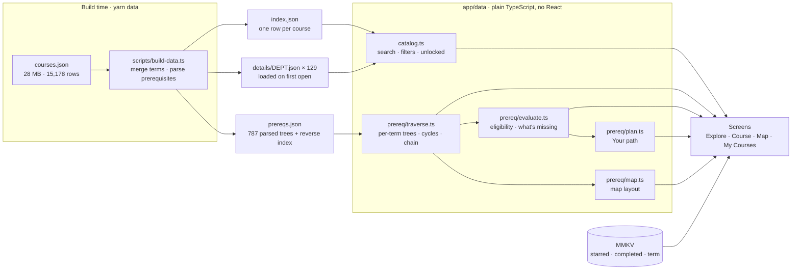
```mermaid
flowchart LR
  subgraph build["Build time · yarn data"]
    raw["courses.json<br/>28 MB · 15,178 rows"] --> script["scripts/build-data.ts<br/>merge terms · parse prerequisites"]
  end
  script --> idx["index.json<br/>one row per course"]
  script --> pre["prereqs.json<br/>787 parsed trees + reverse index"]
  script --> det["details/DEPT.json × 129<br/>loaded on first open"]
  subgraph data["app/data · plain TypeScript, no React"]
    cat["catalog.ts<br/>search · filters · unlocked"]
    trav["prereq/traverse.ts<br/>per-term trees · cycles · chain"]
    ev["prereq/evaluate.ts<br/>eligibility · what's missing"]
    plan["prereq/plan.ts<br/>Your path"]
    mapl["prereq/map.ts<br/>map layout"]
  end
  idx --> cat
  det --> cat
  pre --> trav --> ev --> plan
  trav --> mapl
  prefs[("MMKV<br/>starred · completed · term")]
  cat & trav & ev & plan & mapl & prefs --> ui["Screens<br/>Explore · Course · Map · My Courses"]
```

The same `app/data` code runs in the build script, the app, the Jest tests and the benchmark.

```
scripts/build-data.ts        courses.json -> app/data/generated/   (build time, Node)
app/data/
  types.ts                   shapes of the generated data
  catalog.ts                 loading, lookup, search/filter, "unlocked" query
  prereq/parse.ts            prerequisite text -> AND/OR tree
  prereq/traverse.ts         per-term lookup, cycle checks, full chain (BFS)
  prereq/evaluate.ts         tree vs. completed courses -> met / unmet / unknown; what's missing
  prereq/plan.ts             "Your path": one route to a course, in steps
  prereq/map.ts              the course map: graph, columns, rows, lineage
  generated/                 index.json, prereqs.json, details/<DEPT>.json (committed)
app/screens/                 ExploreScreen, CourseDetailScreen, CourseMapScreen, MyCoursesScreen
app/components/course/       CourseRow, Chip, HeroHeader, FilterSheet, DepartmentPicker, PrereqTree,
                             StarPrompt, CoursePathView, LinkedCodesText
app/components/map/          the course map: MapNodes, MapCard, MapKey, MapControls, edgeGeometry,
                             useMapViewport (pan, pinch, double-tap, tap hit-testing, framing)
app/utils/usePreferences.ts  starred / completed / selected term (MMKV)
app/navigators/              stack (Tabs → CourseDetail) + bottom tabs (Explore, My Courses)
```

- **The data layer is plain TypeScript with no React.** The build script, the app, the Jest tests and the benchmark all use the same `app/data` code. The screens only call its functions.
- **Navigation:** a native stack on top of two tabs. Course pages are *pushed*, so following a prerequisite chain builds a back stack you can retrace.
- **State management:**
  - The catalogue is static and synchronous, so there's no server state to manage. It lives in module-level caches in `catalog.ts`.
  - UI state (search text, filters, the filter sheet's draft) is local component state.
  - The three persisted preferences (starred, completed, selected term) use `react-native-mmkv` hooks, the same mechanism the template uses for its theme. They subscribe to their key, so every screen stays in sync without a context provider or a state library.
  - The rationale is in [D7](docs/DECISIONS.md#d7--state-component-state--mmkv-hooks-no-state-library-2026-09-24).
- **Built on the template:** its `Screen`, `Text`, `TextField`, `Header`, `EmptyState`, themes and typed i18n (`tx` keys, English only). The Ignite demo screens, auth flow and API client were removed.

## How the dataset is processed, searched and filtered

`courses.json` is 28 MB: **15,178 rows = 4 terms × ~3,800 courses**, but only **4,030 unique course codes**. Learning outcomes and descriptions are about half the bytes. Parsing the raw file takes ~100 ms on a laptop (more on a phone), and every launch would pay that. So it's preprocessed once at build time:

| Output | Contents | Size | Loaded |
|---|---|---|---|
| `index.json` | one row per code: code, title, credits, UG/PG, terms offered | 574 KB | first screen |
| `prereqs.json` | 787 distinct prerequisite strings parsed once into trees, plus a reverse index | 176 KB | first course view |
| `details/<DEPT>.json` × 129 | full per-term content | 5.3 MB total, ≤ 457 KB each | when you open a course in that department |

- **Per-term versions.** The same code's content changes between terms: the prerequisites of 117 codes, the descriptions of 107, and the titles of 58. Each course stores a list of *versions*, and terms with identical content collapse into one version. The detail screen shows the version for the semester you're browsing, and falls back to the newest one if the course isn't offered then.
- **Lazy details.** Metro can't `require()` a computed path, so the build script also generates `details/index.ts`, a static map of `DEPT: () => require("./DEPT.json")`. With `inlineRequires` and Hermes bytecode, a department's module runs only the first time it's opened.
- **Search** is a linear scan over lower-cased keys computed once, ranked as: exact code › code prefix › title prefix › title word › title substring › all query words in any order. Codes match regardless of case and spacing. The search input updates immediately, and the list filters on a `useDeferredValue` copy so typing never blocks.
- **Filters** (term, department, UG/PG, "Unlocked for me") are applied in the same pass. The filter sheet runs the same search on its draft to show "Show N courses" before you apply, and the department picker shows live counts under the other filters, so you can see a dead end before picking it.
- **Lists** are `FlatList`s with fixed-height, memoised rows and `getItemLayout`, so ~4,000 rows are never measured. Titles are one line and font scaling is capped so rows always fit.

## How prerequisite traversal works

**1. Parsing** (`prereq/parse.ts`, build time). A small tokenizer produces course codes, `AND`/`OR`, brackets, separators and words. A recursive-descent parser then builds a tree of `course | all | any | text` nodes. The rules come from the data (all 787 strings were profiled):

- `()` and `[]` group, and a spaced ` / ` means OR.
- **OR binds tighter than AND.** Of 175 strings that mix both, only 3 aren't fully bracketed, and the one real case (`ECON 2103, ECON 2113 OR ECON 3113, AND ECON 2123 OR ECON 3123`) only reads correctly this way.
- `,` and `;` take the operator used in their segment (`A, B OR C` → any; `A, B, and C` → all).
- `or above` and `or equivalent` are prose, not operators.
- Text next to a course becomes that course's **note** (`Grade A- or above in` MATH 1014, MATH 1012 `(prior to 2025-26)`). Other text stays a **text** node. Nothing is dropped, and the original string is always shown under the tree ("As written").

**2. The tree view** (`PrereqTree.tsx` + `prereq/traverse.ts`). It shows the course's direct prerequisites, and each course node expands **one level at a time**. So what gets rendered depends only on what you open, not on the size of the graph (the deepest chain, DSAA 3072, is 9 levels). Each node carries its **ancestor path**:
- If a course is already on its own path, it's a **cycle**: it's shown as "↻ Loops back" and can't be expanded.
- The same course on *different* branches is legitimate, and stays expandable.

**3. The full chain** is a breadth-first search with a visited set. It lists every transitive prerequisite once, at its shallowest level, and terminates on cycles and shared subtrees.

**4. "Leads to"** comes from a reverse index built at preprocessing time: an O(1) lookup instead of scanning every course.

**5. Eligibility** (`prereq/evaluate.ts`) evaluates a tree against your completed courses with three-valued logic:
- a course is *met* or *unmet*; free text is *unknown* (the app can't check your HKDSE results);
- AND is unmet if any child is unmet, and OR is met if any child is met;
- unknowns propagate otherwise.

It only evaluates a course's *direct* prerequisites (having completed a course is a fact), so it doesn't recurse across courses and can't loop. "Unlocked for me" runs it for all 4,030 courses in under a millisecond.

**6. Missing prerequisites as choices** (`missingGroups()` in `evaluate.ts`, used by the star prompt). The unmet part of a tree becomes *required* courses and *"one of"* groups, where each option is a list of courses taken together (`one of COMP 2011 / (COMP 1021 + COMP 1022P)`). Free-text alternatives make a group unverifiable, so it's left out; courses the data names twice (LANG 3021 lists LANG 2010 "for DSCT only" and "for all others") are listed once.

**7. Your path** (`prereq/plan.ts`). Picks one concrete route and orders it:
- A completed course is met; a "one of" group that's already met needs nothing more.
- Otherwise a group takes an option containing a **starred** course (your own choice), then the option needing the **fewest courses in total** (its own prerequisites included, memoised), then the first listed. Free-text alternatives are passed over when a course option exists.
- Walking from the target records each chosen course's own chosen prerequisites, with the current path as a stack so loops are cut (and noted) instead of followed.
- Each course's step is one more than its latest prerequisite's (a longest-path layering of the resulting DAG), so step 1 is "can take now" and the number of steps is the shortest possible sequence of terms.

**8. The course map** (`prereq/map.ts`).
- **Graph:** every course in the chain is expanded once; its tree becomes edges into it. A "one of" group with several options becomes a junction its options feed into (an "all of" nested inside one gets its own junction). "Leads to" adds the courses that list this one directly, then one column per course on the explored *trail* (the courses you've tapped through, one per column); a course already on the map isn't moved, and an edge that would point back into it is left out.
- **Loops:** a DFS backwards from the course marks any edge into a node still on the stack. Those edges are drawn (dashed) but don't take part in the layout, so the rest stays a DAG.
- **Columns:** longest path: a course sits one column left of the leftmost course it's a prerequisite for, junctions half a column before theirs, so every edge points right.
- **Rows:** column by column outwards from the course, each node aims for the average height of the nodes it connects to; the column is then spread to a minimum gap and shifted back onto those aims, which keeps most edges close to straight.
- **Lineage** of a selected course is two graph walks (upstream and downstream) over the non-loop edges.

## Performance

`yarn bench` on an M1 Pro (Node). Hermes on a phone is slower, but even 10× these numbers stays well under a 16 ms frame.

| Operation | Median |
|---|---|
| Parse the raw `courses.json` (what we avoid at startup) | 99 ms |
| Parse `index.json` (what we do at startup) | 1.7 ms |
| Search "comp" / "operating systems" over all courses | 0.4 / 0.5 ms |
| Full prerequisite chain of DSAA 3072 (9 levels) | 0.02 ms |
| Evaluate all 4,030 courses for "Unlocked for me" | 0.3 ms |
| "Your path" to CENG 5840 (the largest: 11 courses, 4 steps) | 0.02 ms |
| "Your path" for all 4,030 courses | 7.9 ms |
| Map of MATH 4996 (the largest: 59 nodes) | 0.14 ms |
| Map for all 4,030 courses | 27 ms |

The production iOS bundle is 9.5 MB of Hermes bytecode, mostly the lazily loaded detail chunks ([D9](docs/DECISIONS.md#d9--bundle-size-vs-startup-2026-09-24)).

## Testing

- **Jest (81 tests):**
  - the parser on real-world strings (brackets, precedence, notes, `or above`, enumerators, unbalanced parentheses);
  - traversal (per-term lookup, cycles, self-reference, shared subtrees);
  - eligibility (three-valued logic, "still needed", course status) and missing-prerequisite groups (nesting, duplicates, free text);
  - path planning (cheapest option, completed courses, starred options, shared prerequisites, ordering, loops);
  - map layout (columns and junctions, every edge pointing right, no overlaps, loops, lineage, exploring along a trail);
  - search/filter/unlocked on the **real generated data**, and search-match highlighting;
  - plus the template's i18n key check.
- **Data sweeps:** the star prompt's groups and "Your path" were run for every course in every term (15,178 cases): no crashes, no duplicate rows, no course on its own path. The map was laid out for every course in all three modes (12,090 maps), and explored up to five columns deep from every course (4,364 more): no NaN positions, backward edges or overlapping nodes.
- **Maestro (7 flows in `.maestro/flows`):**
  - search → open → follow a prerequisite → back;
  - the UCMP cycle;
  - filter sheet (department + level) → star → My Courses;
  - complete two courses → eligibility changes → "Unlocked for me";
  - the star prompt: defaults, changing picks, cancelling, "star only", already-starred, required, taken-together and not-in-catalogue courses, and every case with no prompt (120 steps);
  - "Your path": contents, completing a course from the path, a starred option steering the route, starring the whole path, a loop, and no card when there's nothing to plan;
  - the course map: fit, selecting (lineage and card), both sides at once, marking a course completed from the map (with its prerequisites), re-centring and coming back, exploring forward with the breadcrumb, opening a course from the map, the real loop, and no map when there's nothing to draw.
- **Media:** `.maestro/screenshots.yaml` regenerates the screenshots above; `scripts/record-demo.sh explore|map|plan` records the demo GIFs from `.maestro/demos/` (needs ffmpeg).

## Assumptions and limitations

- **Prerequisite parsing is best-effort**, as the brief allows. The rules cover the observed grammar, and anything unusual degrades to readable text rather than being dropped. The raw string is always shown next to the tree.
- **Deeper tree levels use each course's newest version.** Only the course you're viewing follows the selected term, because "the prerequisites of a prerequisite in a given term" isn't well defined.
- **"Leads to" spans all terms.** A course that listed this one as a prerequisite in any term is included.
- **The map explores "leads to" one branch at a time.** All of it at once explodes (MATH 1020 reaches 295 courses in three steps), so each tap opens one course's next column. Free-text requirements aren't drawn as nodes; a course that has them shows "+".
- **"Your path" plans by prerequisites only.** It shows which seasons each course runs in, but doesn't schedule courses into specific terms, balance credit loads, or account for co-requisites and exclusions. Where the data offers a choice, it takes your starred option or the shortest route; star a different option to change it.
- **Eligibility only checks course prerequisites.** Co-requisites, exclusions, grade conditions ("Grade A- or above") and non-course requirements aren't enforced. Grade notes are shown, and text requirements make the result "can't verify" rather than a guess.
- **Section data (quota, enrolment, waitlist) isn't shown**, per the 2026-09-24 brief update. The dataset doesn't include it.
- **Tested on simulators and emulators only**, not physical devices. Android hasn't been re-run since D16–D20 (see [Platforms tested](#platforms-tested)).

## What I'd do next

1. **Re-run Android, and test on physical devices.** Android last passed before D16–D20, and nothing has run on real hardware yet.
2. **Schedule "Your path" into real terms.** It already knows each course's seasons and the order; placing steps into upcoming terms under a credit cap would turn the route into a study plan.
3. **Co-requisites and exclusions** in eligibility and the path. They're shown on course pages but not enforced.
4. **Typo-tolerant search.** Search is exact-substring on normalised codes and words; "algorthms" finds nothing.
5. **Shareable course links.** The navigator already has a `course/:code` route; exposing it would let students send each other a course.

## Documentation

- [docs/DECISIONS.md](docs/DECISIONS.md): every significant decision, with the alternatives considered and why.
- [docs/BUILD-LOG.md](docs/BUILD-LOG.md): how the app was built, step by step, including what the QA pass found.

AI assistance (Claude Code) was used during development, as the brief permits.
